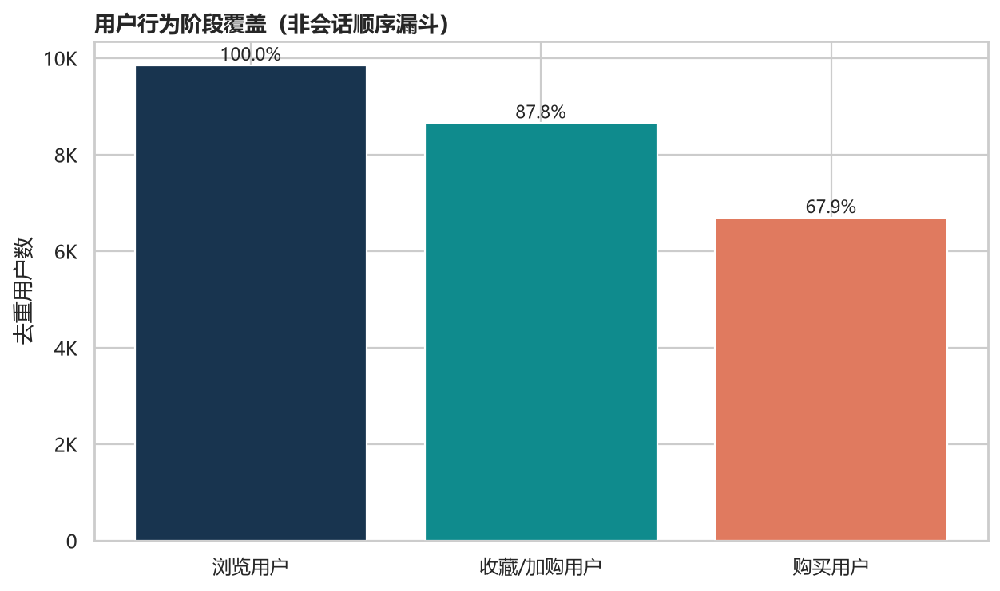
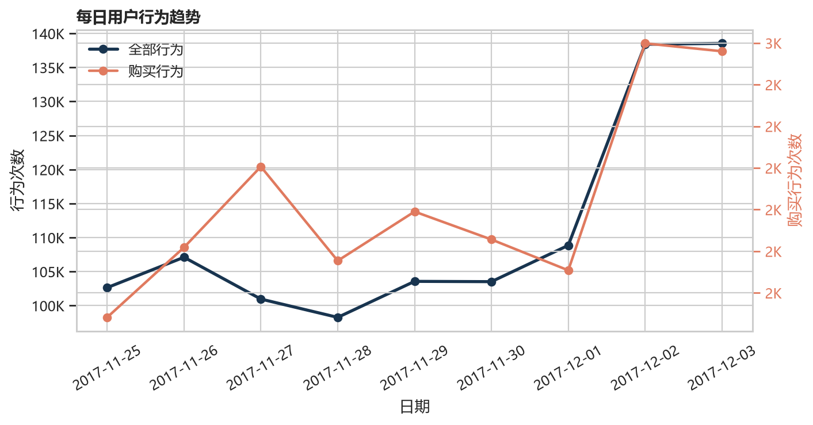
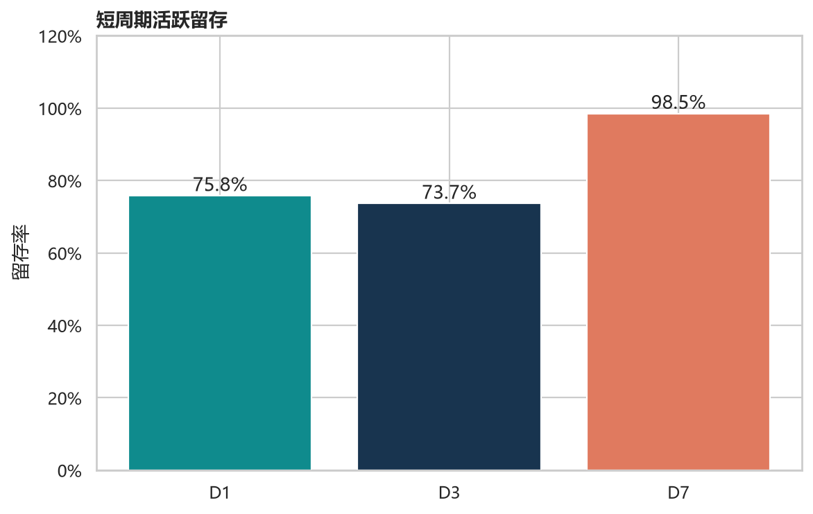
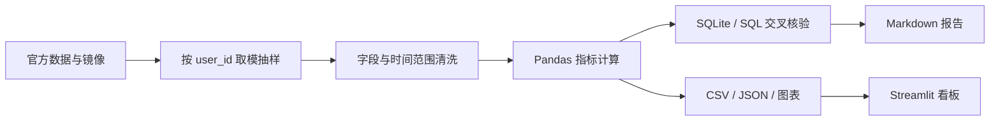

# 购买阶段覆盖67.9%，低于兴趣阶段覆盖87.8%：淘宝用户行为分析

[](https://www.python.org/)
[](https://pandas.pydata.org/)
[](https://www.sqlite.org/)
[](https://streamlit.io/)
[](tests/)
[](https://creativecommons.org/licenses/by-nc-sa/4.0/)

这是一个可复现的淘宝用户行为分析项目：对 9 天、近百万条事件做清洗、行为阶段覆盖、活跃趋势、留存与类目分析，并以 Pandas 计算、SQLite/SQL 复核、Streamlit 展示。核心发现是购买阶段覆盖比兴趣阶段覆盖低 19.9 个百分点。

公开仓库：[linjinjie225-hash/taobao-user-behavior-analytics](https://github.com/linjinjie225-hash/taobao-user-behavior-analytics)

## 在线演示

在线访问：[淘宝用户行为分析 · Streamlit](https://taobao-user-behavior-analytics-mad4xwnihdhcbf2fqvnrez.streamlit.app/)

也可以在仓库根目录本地启动交互式看板：

```powershell
streamlit run dashboard/app.py
```

## 已核验指标

| 指标 | 结果 | 口径 |
| --- | ---: | --- |
| 有效行为事件 | 1,001,832 | 清洗后的浏览、收藏、加购、购买事件 |
| 去重用户 | 9,895 | 清洗后全部活跃用户 |
| 兴趣阶段覆盖 | 87.8% | 收藏或加购用户数 / 浏览用户数 |
| 购买阶段覆盖 | 67.9% | 购买用户数 / 浏览用户数 |

指标来自 [`results/metrics.json`](results/metrics.json)。浏览、兴趣、购买是分别按行为去重用户统计的独立阶段覆盖总量，不代表嵌套人群，也不是会话级顺序转化。87.8% 与 67.9% 的 19.9 个百分点是覆盖率比较，不是“兴趣未购用户”占比。

## 核心发现

### 晚间活跃集中

22:00 的事件量为 83,357，略高于 21:00 的 83,182，是样本窗口的小时峰值。该现象支持优先研究晚间资源与触达节奏，但 9 天样本不足以证明长期周期规律。

### 兴趣与购买覆盖存在独立阶段差

兴趣阶段覆盖 87.8%，购买阶段覆盖 67.9%，相差 19.9 个百分点。由于两个指标独立统计，不能据此推导“有兴趣但未购买”的人数，更不能直接声称增长机会集中在该人群。

### 类目表现分化

类目 `2735466` 的购买行为数最高，为 375 次；类目 `4159072` 的购买/PV 行为计数比为 10.4%。排序结论取决于观察购买量还是计数比，应同时报告分母，不能把购买/PV 解释为购买概率。

## 观察→解释→下一步实验

**观察：** 兴趣阶段覆盖高于购买阶段覆盖 19.9 个百分点。**解释：** 这只是两个独立去重用户总量的差，当前结果没有计算两类用户的交集，也没有证明某个可触达群体造成该差异。

**下一步：** 先在用户层计算 `engaged_without_buy = engaged_users ∩ non_buyers`，核验规模、类目结构与时间分布。确认该交集真实存在且可触达后，再随机分流测试收藏/加购提醒；用增量购买行为率与置信区间评估效果，而非用当前覆盖差替代实验结论。

## 关键图表

### 独立行为阶段覆盖



### 每日活跃趋势



### D1、D3、D7 活跃留存



## 分析流水线



## 仓库结构

```text
dashboard/              Streamlit 数据故事看板
data/source_manifest.json  来源、许可、哈希与抽样规则
docs/                   指标、来源与 AI 协作说明
report/                 完整报告与面试讲解
results/                已核验指标、表格和图表
sql/analysis_queries.sql   核心指标复核 SQL
src/                    获取、清洗、分析、核验、可视化与报告代码
tests/                  分析、输出、看板和发布边界测试
```

## 数据可信度

项目采用确定性的用户级抽样，保留入样用户的全部事件；清洗规则记录输入、剔除与有效行数；核心用户数和行为数由 Pandas 与 SQLite/SQL 交叉核验。来源 URL、许可、文件哈希与样本规则集中记录，避免把本地原始文件误当作可公开产物。

## AI协作

AI 用于候选问题、代码理解、边界检查和文字结构，不作为事实来源。人类负责抽样、清洗、指标定义、执行、SQL 核验、业务判断与最终发布；所有对外数字均回到可执行产物或来源清单验证。

## 分析边界

数据只有 9 天，且没有价格、金额、订单 ID、渠道和用户属性，因此不能计算 GMV、客单价或真实订单复购。重复购买仅是事件/购买日代理；购买/PV 是行为计数比，可能大于 1，PV 为 0 时无定义；阶段覆盖不是顺序漏斗。

## 本地运行

推荐使用 Python 3.11+。原始数据不随 Git 分发；如需从镜像重新采样，先运行获取脚本，再执行流水线。

```powershell
python -m venv .venv
.venv\Scripts\Activate.ps1
pip install -r requirements.txt
python src/acquire.py
python src/run_pipeline.py
python -m pytest -q
streamlit run dashboard/app.py
```

## 延伸文档与数据来源

- [AI 协作说明](docs/AI_COLLABORATION.md)
- [指标定义与限制](docs/METRIC_DEFINITIONS.md)
- [数据来源与抽样](docs/DATA_PROVENANCE.md)
- [阿里云天池 UserBehavior 官方数据页](https://tianchi.aliyun.com/dataset/649)
